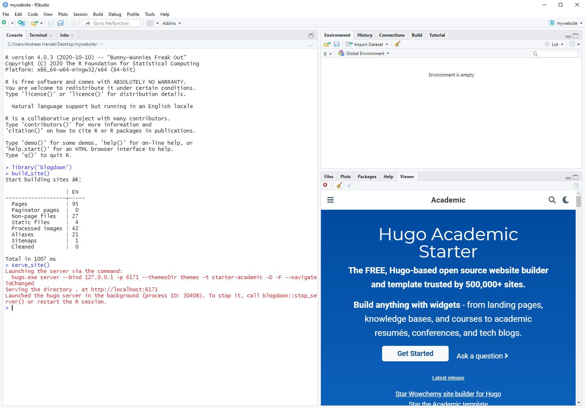
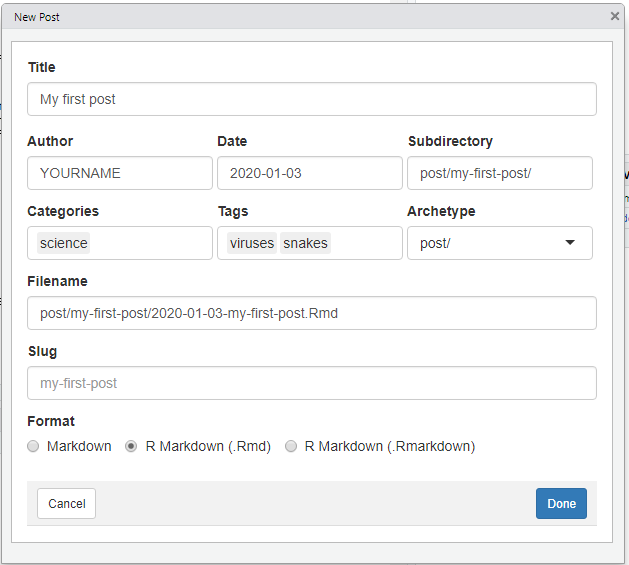

```{r, include = FALSE}
#remotes::install_github('emo')
library('emo')
```

The following are step-by-step instructions for creating your own website using [blogdown](https://bookdown.org/yihui/blogdown/), [Hugo](https://gohugo.io/) and [Netlify](https://www.netlify.com/).

In [part 2](), you will learn how to add [GitHub](https://GitHub.com) to your workflow to make things even more automated and efficient.


# Required skills

I assume that you have general computer literacy, but no experience with any of the tools that will be used. Also, no coding, web-development or related experience is expected. 

# What this document covers

This document is meant to provide you with the minimum required instructions to get your own website up and running quickly. As such, instructions and background information are kept at a minimum. I used a _recipe-like_ approach by giving hopefully detailed and specific enough instructions to get things to work. I'm not covering any _why_ here or provide much further explanations. If you decide you like to use this setup for your website, you will likely want to go beyond this document and learn a bit more about the various tools involved in the process. To that end, links to further resources are provided. Those resources also discuss a bit why you would want this setup versus something like e.g. Wordpress. 

# Who this is (not) for

**This way of making and hosting a website might be for you if:**

* You are (or would like to be) an R, RMarkdown and GitHub user. This is a method of creating a website that very efficiently fits into your workflow. 
* You want a way to host a website where all the content is fully controlled by you, and the website can be hosted without much resources (and for free). 
* You are curious about R/RMarkdown/GitHub, how to use it to build a website, and you've got a bit of time to spare and want to give it a try.

**This way of making and hosting a website might not be for you if:**

* Your workflow is MS Word, Powerpoint, etc. and you are not interested in R/Markdown/GitHub.
* You want everything accessible through a graphical interface.


# Motivating Examples

If you want to see a few nice examples of websites written with blogdown/Hugo, check these out:

* [Allison Hill](https://alison.rbind.io/)
* [Amber Thomas](https://amber.rbind.io/)
* [Malcolm Barrett](https://malco.io/)
* [Flip Tanedo](https://theory.ucr.edu/flip/)

Many more examples of blogdown/Hugo websites are out there. See e.g. [here](https://awesome-blogdown.com/) or [here](https://sourcethemes.com/academic/#expo).


# Quick tool overview

A few different software tools are working together for this website built. **In most cases, they play nicely together and you don't need to worry about details!** But it is still good to know the names of the different components.

**[R](https://www.r-project.org/)** and **[RStudio](https://rstudio.com/products/rstudio/download/)** we won't really use those for their normal purpose as statistics/coding software/platform, but since blogdown is part of the RMarkdown family of packages, we need to use R and RStudio to access blogdown.

**[blogdown](https://bookdown.org/yihui/blogdown/)** is an R package that interfaces with Hugo and allows you to create websites easily using RMarkdown syntax. 

**[Hugo](https://gohugo.io/)** is software that operates in the background. It takes all the content you create for your website (your text, your pictures, etc.), applies layout to your site based on a chosen theme, and turns everything into files that can be placed on Netlify and read by anyone's web browser. You will likely not have to think or learn much about Hugo, at least not initially.

**[Netlify](https://www.netlify.com/)** is the service we'll use to host the website. It offers a free plan, which is great for a starter website (you can always upgrade once you become famous and everyone visits your website. 
Netlify is very easy to set up and use, and it can automatically pull information from GitHub to build your site every time you update it (see part 2 for this). 

While Netlify and RStudio have paid options, for our purpose we can use their free versions. Hugo, blogdown and R are completely free.


# Pre-requisites

First, you need to set up accounts and install some software for the tools we will be using. 


## Get a Netlify account

Go to [the Netlify website](https://www.netlify.com/) and sign up for an account. Follow the sign-up steps to set up your account.


## Install R and RStudio 

If you don't already have it on your computer, [install R first](https://www.r-project.org/). You can pick any mirror you like. If you already have R installed, make sure it is a fairly recent version. If yours is old, I suggest you update (install a new R version).

Once you have R installed, install the free version of [RStudio Desktop](https://www.rstudio.com/products/rstudio/download/). Again, make sure it's a recent version. If you have an older verion of RStudio, you should update.

Installing R and RStudio should be fairly straightforward. If you want some more details or need instructions, see [this page](https://andreashandel.GitHub.io/MADAcourse/1c_RandRStudio.html) (which is part of an online course I teach).


# Starting your website 

With the above registration and installation bits out of the way, you can get started at creating your website. To do so, follow these steps:

* Open RStudio. Install the blogdown package by typing `install.packages('blogdown')` in the R console (the lower left window in RStudio). Note that all `R` commands are case sensitive. You need to be online for this to work. You should see `blogdown` and several other packages being installed. You only need to do this step once, unless you upgrade R or change computers.
* Load `blogdown` by typing `library(blogdown)` into the R console (you need to do thos every time you open/re-load R/RStudio). 
* Under `File`, choose `New Project`, `New Directory`, `Website using blogdown`. On the following screen (see the figure below), specify a meaningful directory name (e.g. YOURNAMEWEBSITE), place it somewhere on your computer, check all boxes (apart from 'open in new session'), and write `gcushen/hugo-academic` into the Hugo theme box. 


```{r startwebsite,  echo=FALSE, fig.cap='', out.width = '80%', fig.align='center'}
knitr::include_graphics("startwebsite.png")
```


Now click `Create Project`. This creates a new website and installs and sets up the chosen theme, complete with a small sample site. Be patient, it might take some time. As long as you see a little red stop sign in the top left corner of the R Console window, you know things are still running. Once everyting is done, a file called `config.toml` will likely pop up. Ignore for now. You will see a lot of new files have shown up in your project/repository folder. 

The command above installed a small example site. We can look at it by asking RStudio/blogdown to _serve_ the site by typing `serve_site()` into the R console. You might get a warning message, but hopefully things work and the bottom right window, which is the RStudio viewer, shows a website in blue (see figure). 

```{r servesite, echo = FALSE, warning=FALSE, fig.align='center', out.width='80%'}

```

Click on the symbol next to the broom in the top left corner of that window to see the website in your browser. This is your new site. Now it's time to customize and create content.


## A word about themes

Pretty much all modern websites follow the concept of splitting content from layout and only merging them at some point in the process of building a website. The formatting that gives a site a specific layout is often called a **theme**. The theme determines the look of your website. Hugo has a lot and quickly growing [number of themes](https://themes.gohugo.io/) (though not as many as Wordpress). The idea is that you can switch themes and thus layout without too much difficulty. In practice, there is still often a good bit of adjustment needed when you go from one theme to another. Thus, it is worth spending some time deciding on a theme before you go "all in". The [Academic theme](https://sourcethemes.com/academic/) we use here is currently one of the most popular ones for Hugo. It has a lot of features. The drawback of that is that it's fairly complex. I considered gpomg with a simpler theme, but I figured to illustrate what's possible, and because it's widely used and under active development, we'll go with this theme. You can explore different themes later. 


# A brief explanation of your new website

The previous steps have given you a website with some example starter content. Any complex website has a certain structure consisting of folders and files. These files and folders either live only on a website server and you never see them (e.g. Wordpress), or they exist locally, as is the case for Hugo (and similar such website generators, e.g. `Jekyll`.)

Some of the files and folders you do not need to care much about, others you will need to intereact with. To get a bit of an idea what lives where, here is a quick overview. Some of this depends on the Hugo theme you are using, but most of them have a rather similar structure. Open the directory where you placed your website, either through the `Files` pane in RStudio, or by using File Explorer (or whatever that is called on a Mac\Linux `r emo::ji('smiley')`).

* The folder `config` contains files that control some of the overall website look and feel. We'll visit them later. In Hugo, those files that control configuration are called either `TOML` or `YAML` files. Many files have both bits of TOML/YAML and other content in them, as you will see below.
* The folder `content` and its subfolders contain almost all the actual content for your website. We'll edit some of that soon.
* The folder `public` is the one that contains your finished website once Hugo has processed your content and applied the layout from your chosen theme. That folder is the one which is deployed to a webserver. As you will see below, for our setup all this happens automatically, so you never really have to care about this folder much.
* The folder `static` contains subfolders where you can store images and other media (e.g. pdf files or video/audio, etc) that you want to be part of your site.
* The folder `themes` includes the different Hugo themes you installed. You can have several themes installed and switch between the one you want by editing the configuration files. Note however that themes differ in their details of how they do things, so it is a good idea to check out a few themes first, then settle on one and build your website _for real_ once you picked one.
* The other folders that might exist are ones you don't need to worry about, at least not initially. Some of those folders can contain your own formatting and layout choices overwriting the main theme. We won't discuss them here but once you really want to start configuring your site, those will become important. 


# Editing content

## Playing with widgets


Now that you know a little bit how your website is structured, let's dig in and add and modify it. We'll start with some modifications, followed by creating new content.

All (or at least most) content goes into the `content` folder and its subfolders. Content is generally written in (R)Markdown. Markdown is very easy to learn. If you are not familiar with it, check out [this nice interactive tutorial](https://www.markdowntutorial.com/) or this [cheatsheet](https://github.com/adam-p/markdown-here/wiki/Markdown-Cheatsheet). See e.g. the RMarkdown section on [this page](https://andreashandel.github.io/MADAcourse/1e_ToolsforReproducibility.html) for a bit more information and further links to resources. We'll take it slow and I'll guide you through it.

The Academic theme, and many other modern websites, use a layout that employs **widgets**, which are components of a site that are individually formatted and styled. On the demo site you just created, you see many different sections, each is a widget. Which widgets you want is controlled by files in the `/content/home/` folder. Go into that folder (from within RStudio) and open the `demo.md` file. You will see a bunch of text. Some commands are between `+++` signs, this is called the TOML (or YAML if it's 3 `---`) header. These are instructions for the layout. The text below is what is actually shown on the site.

As you stare at the content of the file, you might recognize that it corresponds to the 2nd block of the demo website with the dark bubble content. Let's say you don't want this particular widget on your home page. The easiest way is to set `active = false`. (You can also delete the whole file if you are sure you don't want it). Do that. You should notice 2 things. In the bottom-left RStudio window (the R console) you should see a bit of code showing that the website was re-built and updated in real time. If you re-load the page in your browser, the widget and its content should be gone. You can try turning off other sections of the main page using this approach.


## Making things personal

Now let's open the `about.md` file. You will notice that it doesn't really contain any content. Instead, it pulls the content from another location, namely the specified file in the `authors` folder. Go into `/content/authors/admin/` and open the `_index.md` file. There you see the content that is displayed on the main page. Modify it with your personal information. Once you save your changes, you should see the website automatically being rebuilt. If you have, add a picture of yourself and replace the current `avatar.jpg` file. (Your picture needs to have that name). Also, while not required, you might want to rename the folder from `admin` to your name. Make sure this corresponds to the name you linst in the `_index.md` file.


## Cleaning up for now

Let's turn off all other parts of the main site apart from the `about` widget. The easiest way is to remove all files apart from the `index.md` and `about.md` files. You probably don't want to completely delete them (since you might want to use them later), thus I recommend you move them to some other folder on your computer. For instance you can make a folder called `myfiles` as a subfolder of your website folder and move the files into that folder.

If all of this worked, there should be a main page containing only 


## A word on error messages.

If you make some changes which breaks the site, you will see an error message in the R console and the site won't re-compile until you fix the problem. You often have to be careful to write things exactly as specified, and often with the right indentation, etc. Some fiddling is at times required. If you are stuck and think you broke it too badly, you can either look in the [Academic theme documentation](https://sourcethemes.com/academic/docs/) or go into the `themes/hugo-academic/exampleSite` folder and find the corresponding file you are editing there and see how it needs to look.


# Editing settings

## config.toml
I mentioned above that TOML/YAML is a language/structure used by Hugo to control all kinds of things. Most files have some TOML/YAML part, a few files are nothing but TOML and control a lot of settings. Let's look at the most important files. The first one is `config.toml` located in the main website folder. Find and open it. You will see that it lists as title _Academic_. Change that to e.g. _Website of YOURNAME_. You will see this change show up on the main site. You can try what happens if you write something in the `copyright` section. The rest of this file doesn't need further editing for now.

## menus.toml
Let's go into the `config/_default/` folder and open the `menus.toml` file. You'll see that those correspond to the menu buttons on the main page. Most of them don't work since we removed the widgets. For now, let's go ahead and disable (by placing `#` symbols in front) all entries apart from the `Posts` block of text.

## params.toml
open `params.toml`. This file lets you specify and control a lot of things. Try setting a different theme. Then read through the other parts. We won't change them for now, but you might want to come back to them.


# Create new content

Let's create a blog post. First, let's move the `posts.md` file back into the `home` folder. If successful, you should see several blog posts show up on the site. The actual files containing those posts are in the `content/post` folder. (Academic is unfortunately not very good about consistently using singluar or plural). You will see one file (both `.Rmd` and `.html`) in the main `/post` folder. That file was placed there by RStudio/blogdown. You will also see several folders, each containg a `.md` file and one or more images. Those are placed there by the creator of Academic. Both ways of placing blog posts is ok but separate folders tends to be more organized. Let's first remove the existing posts. You can either delete them, or to be save, move everything (apart from the `_index.md` file) to the folder you created earlier. You should see all posts disapear from the main page. 

Now let's create our first blog post. We can use an RStudio addin for this. Since I have found that sometimes the `serve_site()` command interferes with the addin functionality, let's stop the serving (continuous building and displaying) of the website for now by restarting `R` (under `Session`).

Once you have restarted `R`, go to the `Addins` button (approximately under the `Tools` button) and choose `New Post`. Fill in the fields like shown in the figure. You can of course alter the categories and tags. Note that you should add another subdirectory below `post/` so the blog post is created in its own folder.

```{r firstpost,  echo=FALSE, fig.cap='', out.width = '80%', fig.align='center'}

```

Once you click `done`, the file should open. You will see that the things you specified in the boxes show up in the TOML area. Write some text below the TOML area (below the `---`). Save your changes, then start the server again by re-loading the blogdown package (`library(blogdown)`), then type `serve_site()` into the `R` console.

## More edits

Congratulations, you have built a website and wrote a blog post! Of course there is a lot you can do next. Write more posts, look at all the different elements/widgets you can turn on and modify, etc. As mentioned, the Academic theme has a lot of features. If you like what you see, continue exploring. If you think you want something simpler, check out other Hugo themes until you find one you like, then customize it. A lot of things are very similar across all Hugo themes (e.g. the TOML/YAML bits and the folder structure), but some details differ, so it's good to pick a theme before you really start customizing it. 

But for now, we'll leave it at this. There is one more crucial step missing though.


# Making your website public

So far, everything happened on your local computer. In a final step, we want to put the website online so everyone can see it. With Netlify, this is fairly simple. Log into your Netlify account. Under `Sites`, you should see a white box that says "drag and drop your site folder here". Take the folder named `public` inside your website folder and drag it into that box. If things work right, after a few seconds you should see that your site is deployed. It will have a weird name and a URL (mine when I tried it just now was called `https://cranky-lamport-fff53a.netlify.com/`). Click on it and you will see your new website publicly online for everyone to see!  

If you want, you can change the name of your site under `Site settings`. More advanced (not free but also not too expensive and not that hard) is to get your domain name, e.g. `www.yourname.com` or something like that. 

In part 2 of this tutorial, you'll learn how to use Github to make deployment to Netflify fully automatic.

For now, you can either leave the website as is, or if you want to make it better first before putting it online, you can under `Site Settings` in the `Danger Zone` area delete the site. That only deletes the online version, so you can re-create at any time.


# More Information

There is a lot of good information on blogdown available. I recommend the following:

* A short introductory course is Alison Hill's [summer of blogdown](https://alison.rbind.io/project/summer-of-blogdown/). Alison also has several blog posts on her website discussing more advanced concepts of Hugo.
* A lot of details and further information can be found in [the blogdown book](https://bookdown.org/yihui/blogdown/).

For the Academic theme, check out the link to the docs for the theme above. While they could be improved, there are quite comprehensive.


