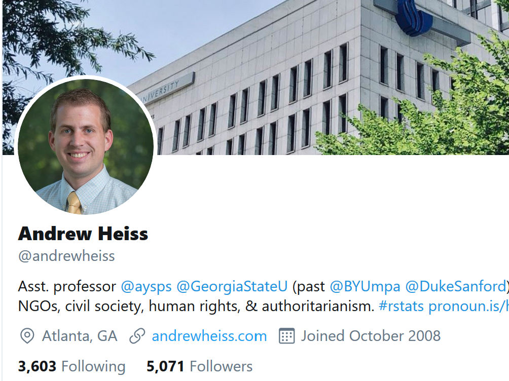

## Motivation
<div style="float: left; width: 50%;">
* You will likely have many jobs throughout your career.
* Freelance/self-employed jobs keep growing.
* Most good jobs (and other opportunities) are found through connections.
* **Think of yourself as a "brand".**
</div>

<div style="float: right; width: 50%;">

```{r brand,  echo=FALSE, fig.cap='Photo by Markus Spiske on Unsplash', out.width = '80%', fig.align='center'}
knitr::include_graphics("./mercedes-brand.jpg")
```
</div>


## Motivation
* People (potential collaborators, employers, employees, etc.) will look you up online.
* If you don't control your online presence, you are at the mercy of what shows up.

```{r embarassing,  echo=FALSE, fig.cap='https://on.rt.com/8zyi', out.width = '70%', fig.align='center'}

```


## How to build and manage your brand
* Create and curate an online presence.
* Create and curate content.
* Develop a _brand identity_, i.e. who you are (professionally).


## Content types
* Created "once", then updated:
  - your online persona (CV/profile)
  - resource repositories
  - teaching materials
  - ...
* Created "once" (but regularly), then static:
  - blog posts
  - videos
  - ...
* Created often, not very permanent:
  - Twitter
  - ...

## Ways to build and manage your online presence
* General sites
* Academia/Science specific sites
* Self-built site(s)


# General Sites

## 

<div style="float: left; width: 50%;">
```{r linkedin,  echo=FALSE, fig.cap='', out.width = '80%', fig.align='center'}
knitr::include_graphics("./linkedin.png")
```

* **The** professional networking site. Almost required to be on there. 
* You can customize your profile a good bit.
* A good way to showcase yourself.
</div>

<div style="float: right; width: 50%;">
* Great for finding/connecting with others.
* LinkedIn is useful even if you are not looking for a job!
* Build a good profile early, not a week before you start applying.
* Some features require a subscription.
* Examples:
  - [Stephanie Eick](https://www.linkedin.com/in/stephanie-eick-phd-mph-50a0b079/)
  - [Andrew Heiss](https://www.linkedin.com/in/andrewheiss/)
</div>


## Twitter {.smaller}
<div style="float: left; width: 50%;">
* Great for learning about new developments in your field.
* Good way to connect and engage with the community, and to announce your work.
* Need to be used (active and/or passive) for it to be useful. 

```{r twitter2,  echo=FALSE, fig.cap='', out.width = '90%', fig.align='center'}
knitr::include_graphics("./stephanie-eick-twitter.png")
```
</div>


<div style="float: right; width: 50%;">
* Need to decide if you want to mix professional and personal. 
* You can create/use multiple accounts.
* Consciously decide on the topics you will engage with.
* Learn 'the rules' (tweet/re-tweet/reply/like/hashtags/etc.).

```{r twitter3,  echo=FALSE, fig.cap='', out.width = '90%', fig.align='center'}

```
</div>


## [GitHub](github.com/)
* A great tool to manage projects and work collaboratively.
* Great way to showcase any 'products' you've made.
* Lets you create simple websites fairly easily.
* Somewhat technical, takes time to get used to it.
* Showing you know/use GitHub is a desirable skill by itself.
* [Great perks for students](https://education.github.com/pack).
* Examples:
  - [Awsome Data Science](https://github.com/academic/awesome-datascience)
  - [Research and Teaching Resources](https://andreashandel.github.io/research-and-teaching-resources/index.html)
  - [Basic stats course](https://tinystats.github.io/teacups-giraffes-and-statistics/index.html)
  - [MADA](https://andreashandel.github.io/MADAcourse/)


## [YouTube](youtube.com/)

* Good for teaching, also useful for outreach.
* You can create your own channels for specific projects.
* Examples:
  - [Jeff Leek](https://www.youtube.com/user/jtleek2007)
  - [David Robinson](https://www.youtube.com/channel/UCeiiqmVK07qhY-wvg3IZiZQ)
  - [John Muschelli](https://www.youtube.com/user/mjmusch/videos)


## [Facebook](facebook.com/)
* _Everyone_ is on it.
* Good way to stay connected with folks.
* Some educators use Facebook groups for classes.
* Hard to keep professional and personal lives separated (unless you create 2 accounts).


## [Medium](https://medium.com/)
* Platform for blog posts.
* They promote, you can potentially get paid.
* Not as much control as on your own website.
* Other similar platforms likely exist.
* Examples:
  - [Statistics, we have a problem.](https://medium.com/@kristianlum/statistics-we-have-a-problem-304638dc5de5)


## Other general platforms
* Instagram/Snapchat/etc.
* Often special purpose (e.g. posting images).
* I have little experience.
* I don't know of any such platform that is much used in (science) academia, but might be useful for outreach.


# Academia/Science specific sites

## Academia/Science specific sites
* Google Scholar
* ORCID
* ResearchGate
* Academia.edu
* Mendeley
* ImpactStory
* Publons
* ...

## Google Scholar 
* Only for publications (broadly speaking).
* Gives citation metrics.
* Is fairly automated, you have to do very little.
* Great way to keep track of your papers.
* Examples:
  - [Stephanie Eick](https://scholar.google.com/citations?user=wKXbh1UAAAAJ&hl=en&oi=ao)
  - [Andrew Heiss](https://scholar.google.com/citations?hl=en&user=FNq1cyQAAAAJ)

_If I want to get a quick idea who someone "is" in academia, I check their Google Scholar page._

## ORCID
* Gives you a unique ID to track your research productivity.
* Used by a lot of journals.
* Very useful if you have a (slightly) common name (but even if not).
* Free and not-for-profit.
* Examples:
  - [Stephanie Eick?](https://orcid.org/0000-0001-6695-3291)
  - [Andrew Heiss](https://orcid.org/0000-0002-3948-3914)

## ResearchGate/Academia/Mendeley/etc.
* All are versions of academic social network sites.
* All are commercial.
* You have various levels of control of how your profile looks like.
* Sites are trying to encourage interactions.
* Examples:
  - [Stephanie Eick](https://www.researchgate.net/profile/Stephanie_Eick)

_I haven't found those sites useful. I therefore deleted my accounts on those sites since I want to control my web presence myself and don't want to keep too many sites up-to-date._

## ImpactStory/Kudos/Publons/etc. 
* Sites that try to measure your 'impact'.
* Maybe fun, but I haven't found them too useful yet.
* Examples:
  - [Alison Hill](https://profiles.impactstory.org/u/0000-0002-8082-1890)


## Own website
* You have complete control.
* You have to build and maintain it yourself.
* Lot's of ways to do that. Many are free.
* We'll do that in a separate session (if you want).
* Examples:
  - [Andrew Heiss](andrewheiss.com/)
  - [Lucy and Nick blog](https://livefreeordichotomize.com/)
  - [Lucy website](https://www.lucymcgowan.com/)
  - [Jeff, Roger, Rafa blog](https://simplystatistics.org/) 


## Some general suggestions
* Decide what you want to be known for, create and curate content accordingly. 
* You don't need to duplicate, e.g. you can link to your Google Scholar publications from LinkedIn.
* Give some thought to the platforms you want to use, but you can fairly easily move around.
* Better have fewer online outlets that you keep up-to-date with good quantity/quality content than being on too many platforms.

## Some general suggestions
* Content (e.g. blog posts, videos) can be any length and level of difficulty.
* Anything that might be useful to others (or your future self) is worth putting out there.
* Things don't always need to be polished, but do have some minimum standard of quality.
* If you have the discipline, consider creating content on a regular schedule.
* Figure out how to 'advertise'.

## Some general suggestions
* You might want to have more than one 'online brand'.
* Make sure you keep things reasonable updated and working.
* Set Google alerts for your name (or other keywords).
* Consider measuring your impact (e.g. Google Analytics, GitHub stars).


## Further Resources
* [The A to Z of social media for academia](https://www.timeshighereducation.com/a-z-social-media)
* [Research impact challenge](https://blog.impactstory.org/impact-challenge-day-1-academia-edu/), also see [this pdf book](http://blog.impactstory.org/wp-content/uploads/2015/01/impact_challenge_ebook_links.pdf). It's a bit outdated and recommends things I'm not too fond of (e.g. Academia.edu/ResearchGate), but has still some nice information.


